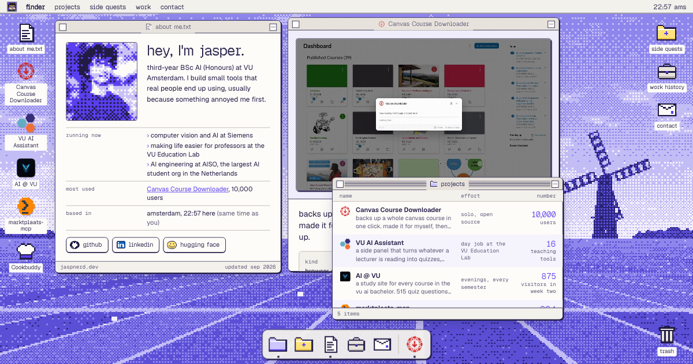

# jaspnerd.dev

Personal portfolio of **Jasper Meijerink**, AI student at VU Amsterdam.
Live at [jaspnerd.dev](https://jaspnerd.dev).



## Stack

- [Astro 7](https://astro.build): static output, zero-JS baseline, content collections
- [Tailwind CSS v4](https://tailwindcss.com): CSS-first config (`@theme`, no config file)
- [GSAP](https://gsap.com) Draggable + Inertia: the window manager
- Hand-written WebGL2 for the pixel and dither effects (`src/lib/fx/`), no 3D library
- Self-hosted fonts via [Fontsource](https://fontsource.org): Geist, Geist Mono, Geist Pixel

## Design notes

The site is a small desktop OS: a dithered polder wallpaper, draggable windows,
desktop icons, a dock, and a phone home screen on small viewports. Projects and
work history are content collections (`src/content/`), media is found by
convention per project slug (`src/lib/media.ts`), and every window also renders
as a plain document without JavaScript.

Motion follows [Emil Kowalski's](https://emilkowal.ski) design-engineering rules:
strong ease-out curves, sub-300ms micro-interactions, transform/opacity only, and
full `prefers-reduced-motion` support. The site stays readable with JavaScript
disabled.

## Development

```sh
npm install
npm run dev      # dev server
npm run check    # astro type check
npm run build    # static build to dist/
```

## Deployment

Pushes to `main` run CI (check + build) in GitHub Actions, then trigger a
[Coolify](https://coolify.io) deployment on a Hetzner VPS via webhook. Coolify
builds the site and serves `dist/` behind Traefik with automatic HTTPS.
